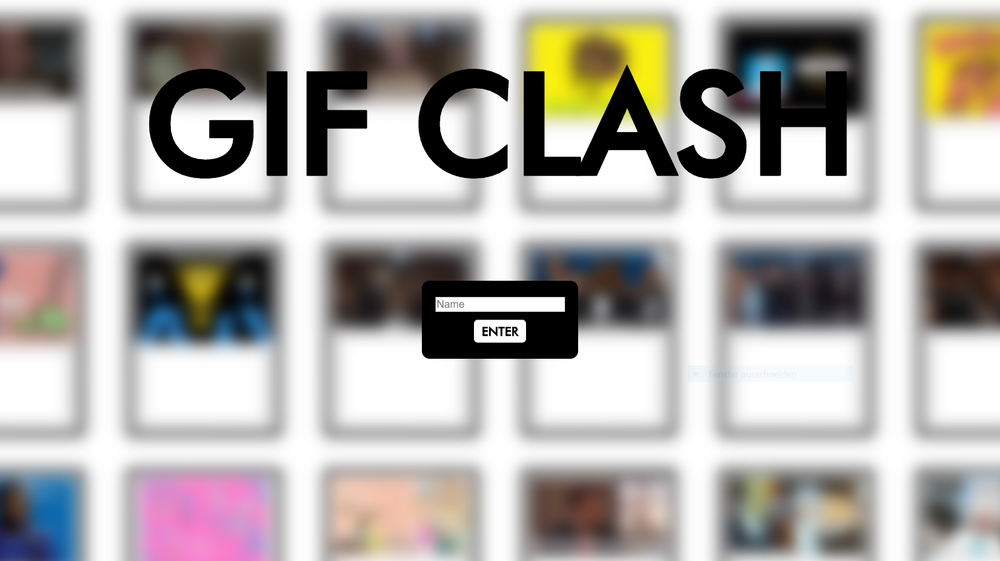

# gifclash.io

## Summary:
An online multiplayer card game that mixes Cards Against Humanity with Gifs.

## How to Play:
1. Create a game and wait for at least 3 players to start match.
2. The match starts with a card draft: Each player names 2 random things. Cards with Gifs about those 2 things will be randomly distributed to all players.
3. Each round starts with a dealer-situation where one of the players chooses a random topic on his screen or enters his own phrase.
4. All players see the topic for this round and choose a card to play. They can add a funny or serious comment directly on the card.
5. Once all players have played their card, everyone gets to vote for one of the other players cards.
6. The winner gets a point, each player gets a random new card and the next round starts with a new dealer.
7. First player to 3 winning rounds wins the match.

## Tech Stack:
* jQuery & jQuery UI
* Node.js
* Socket.IO
* Giphy API
* Twitter API

## Features:
* Single-page application
* 3-6 players
* Live online multiplayer
* In-game chat
* Multiple games at the same time on one server instance
* Randomized through Giphy API and Twitter API requests: No game is alike!
